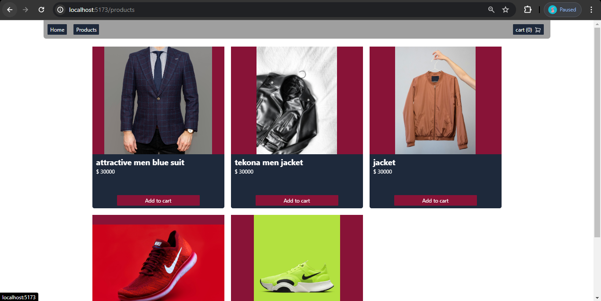
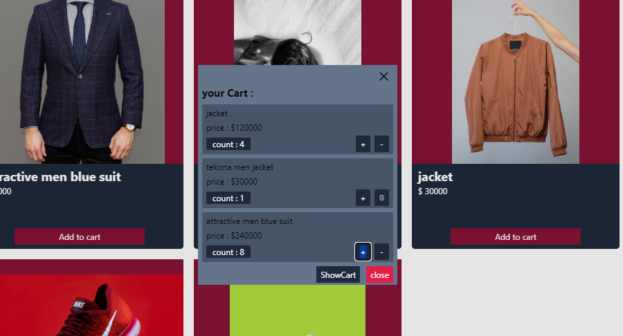
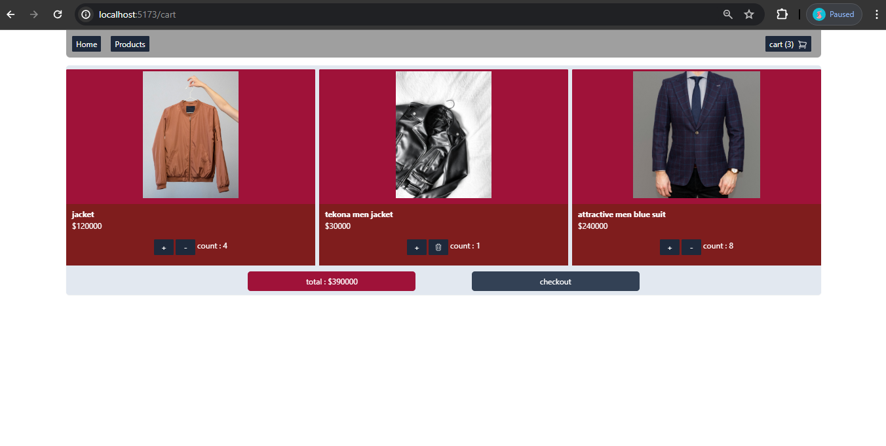
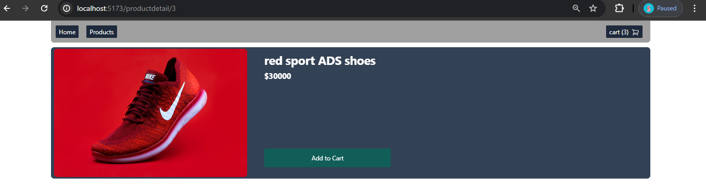
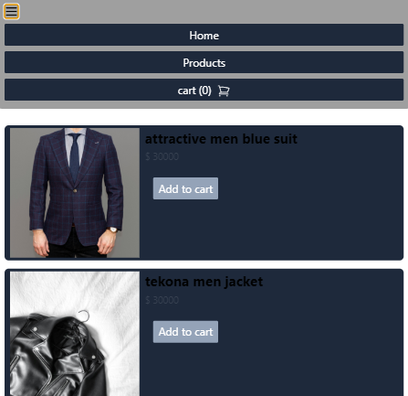
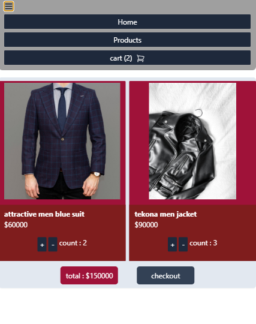

## About App 

- this is a simple web ecommerce application built with React.js .
- in products section it fetch data than a json-server api (its also in localhost , its in database.json).
- for Cart section it provide Context-Api approach for storing state of Cart. 
- Cart also have a Modal witch have its own Context-Api for Modal opening-closing management.
- it's using tailwindCss for styling. 
- routing is provided with react-router-dom packege (see Route/router.jsx).
- not found page is provided by router (see pages/NotFound.jsx component).
- images : 

